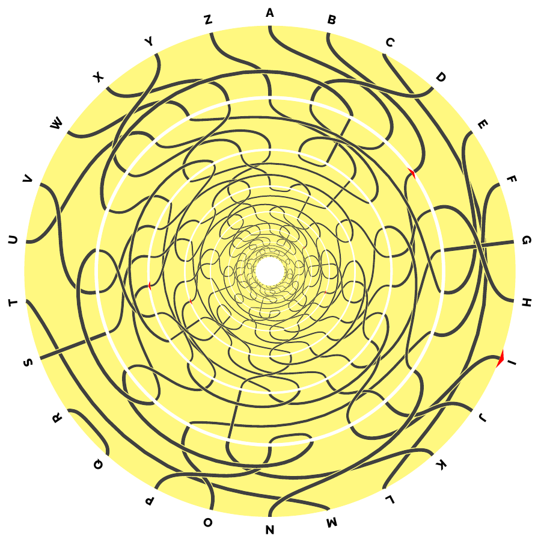

# Enigmaxi
The Enigmaxi machine is an Enigma-inspired encryption machine appearing in problem 12 of the [AIVD kerstpuzzel 2025](https://www.aivd.nl/onderwerpen/aivd-events/aivd-kerstpuzzel), the annual Christmas puzzle of the Dutch General Intelligence and Security Service. See below for an explanation of how it works. The puzzle (in Dutch) can be found on the AIVD website and is intended for a general audience. Except for an implementation of the Enigmaxi in Haskell, this repository does not contain any information regarding the solution of the puzzle. One thing we do note is that **the enigmaxi machine is flawed by design and should not be used for encryption in practice**. The puzzle is to find and exploit these flaws.

I made this implementation to try out Haskell and functional programming. The Enigmaxi seemed a fun choice for such a project because of its recursive structure with an infinite set of rotors. I also tried out a bit of Clash by describing a circuit that functions as a single-rotor version of the Enigmaxi. For this single-rotor version I included a simple proof in Lean of the fact that the encryption algorithm is its own inverse.

## The Enigmaxi machine
Essentially, at any given point in time the Enigmaxi machine defines a permutation of the alphabet of order 2. It consists of a wheel of infinitely many rotors that are all identical but may be turned independently. The initial position of the rotors is determined by a keyword, say of $n$ letters. Then we set the first $n$ rotors in the positions determined by the keyword and for deeper rotors we repeat this pattern ad infinitum. With the keyword "IETS" the wheel looks like this: 



To encrypt a letter $\alpha$, we start on the boundary of the wheel at $\alpha$ and follow the path through the wheel. If we return to the boundary of the wheel at the letter $\beta$, then the encryption of $\alpha$ is $\beta$. It can happen that the path never returns to the boundary. In that case we say that the encryption of $\alpha$ is $\alpha$ itself. We are given two examples for when we start with the keyword "IETS": If we start at the letter 'Z' and follow the path then we enter the second rotor at 'A' and the third one at 'D'. Following the whole path, we exit the first rotor again at the letter 'J', so the encryption of 'Z' is 'J'. If instead we start at the letter 'H', then at some point in its path we enter the fourth rotor also at 'H'. The self-similarity of the wheel then implies that from there the path will keep repeating itself. So the encryption of 'H' is 'H'.

After encrypting a letter we turn all the rotors that we visited during the encryption of that letter one step in clockwise direction. In our example, for the letter 'Z' we got to the fifth rotor so we turn the first five rotors one step. For the letter 'H' its path goes through all rotors so we turn all the rotors one step. After this we proceed with encrypting the next letter in a message.

The puzzle makers give us one example to test our implementation. With keyword "IETS" the message "DAT DOEN WE NIET VOOR NIETS" should be encrypted to "XAS DIMF WR TIXK WCJA MJVIR".

## Haskell
The file `enigmaxi.hs` contains an implementation of the full Enigmaxi machine in Haskell. You can test it by loading it in GHCi and running
```ghci
enigmaxi "IETS" "XAS DIMF WR TIXK WCJA MJVIR"
```
In `singleRotor.hs` we implement a greatly simplified version of the Enigmaxi with only one rotor. The rotor we use here is a reflector and is different from the original Enigmaxi rotor. In this version the keyword is a single alphabetic character. Again, you can play with it in GHCi:
```
  singRot 'X' "PSB ASWR KV KSC RLUX RRFO DRAKQ"
```

## Clash

